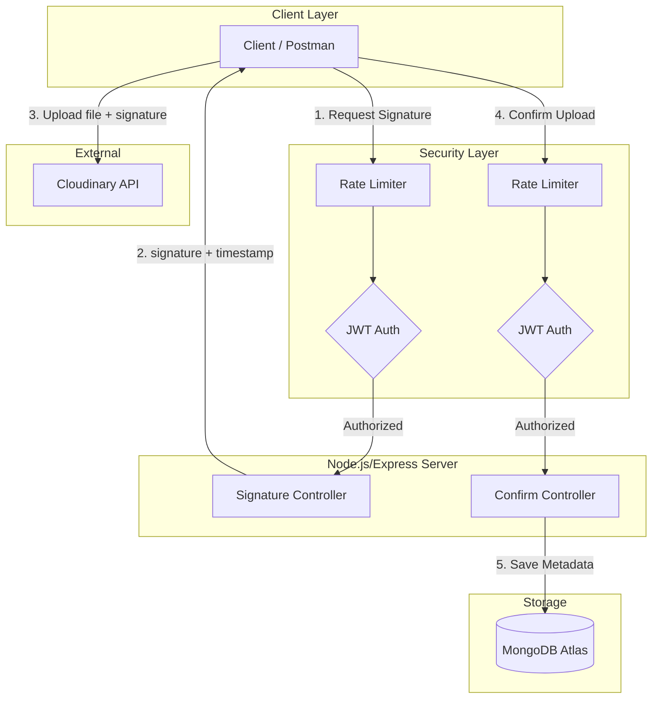

# Quick Drop Backend 🚀
A high-performance, **Headless API** for file-sharing and authentication. This project focuses exclusively on backend scalability, secure data integrity, and efficient cloud storage management.



## 🛠️ Tech Stack
* **Runtime:** Node.js (ES Modules)
* **Framework:** Express.js
* **Database:** MongoDB (Atlas)
* **Storage:** Cloudinary API (Binary Data Management)
* **Security:** JWT Authentication, Bcrypt, and Rate Limiting
* **Testing:** k6 (Load & Stress Testing)

## 📊 Performance & Load Testing
The API was subjected to rigorous stress testing to simulate real-world concurrent traffic.

| Metric | Result |
| :--- | :--- |
| **Concurrent Users** | ~150 |
| **Success Rate** | 100% |
| **P95 Latency** | 3.4s* |
| **Test Tool** | k6 (Go-based load testing) |

> [!IMPORTANT]
> **Performance Note:** The P95 latency of 3.4s is due to **Render Free Tier** spin-down policies (Cold Starts). In a production environment with dedicated resources, the latency is significantly lower. The 100% success rate confirms the architectural stability of the system.

### 🧪 API Documentation & Functional Tests
All endpoints, including request/response schemas and authentication requirements, are fully documented:

👉 [**View Interactive API Documentation**](https://documenter.getpostman.com/view/52408813/2sBXinFpx1)

## 📂 Project Structure
```text
├── config/             # Database and Cloudinary configurations
├── controller/         # Request logic (Auth, File handling)
├── middleware/         # Auth guards and Rate Limiting setup
├── model/              # MongoDB Schemas (User, File)
├── routes/             # Express Route definitions
└── validation/         # Data integrity: cleanup logic for incomplete/junk file entries
```

## 🚀 Key Features (Backend Only)
* **Headless Architecture:** Pure JSON-based API designed to be consumed by any client (Web/Mobile/CLI).
* **Junk File Validation:** Integrated logic within the validation layer to identify and prevent "orphaned" entries in the database.
* **Collision-Resistant Naming:** File ID system using `timestamp + filename` to ensure unique storage paths in Cloudinary.
* **Rate Limiting:** Protects endpoints from brute-force attacks and resource exhaustion.
## 🛠️ Development & Testing
To ensure API reliability and performance, I followed a multi-stage testing workflow:

* **Functional Testing:** All endpoints were validated using **Postman** to ensure correct status codes (200, 201, 400, 401, 500) and accurate JSON schema responses.
* **Load Testing:** Used **k6** to simulate high-concurrency scenarios (~150 users) to verify the system's stability under stress.
* **Data Integrity:** Verified that the `validation/` layer correctly handles "junk" files and keeps the MongoDB/Cloudinary state synchronized.
## ⚙️ Installation & Setup
1. Clone the repository:
   ```bash
   git clone https://github.com/HiteshRahul27/quick-drop-backend.git
   ```
2. Install dependencies:
   ```bash
   npm install
   ```
3. Setup `.env` (Use your Cloudinary/MongoDB credentials).

4. Start the server:
   ```bash
   npm start
   ```

---
